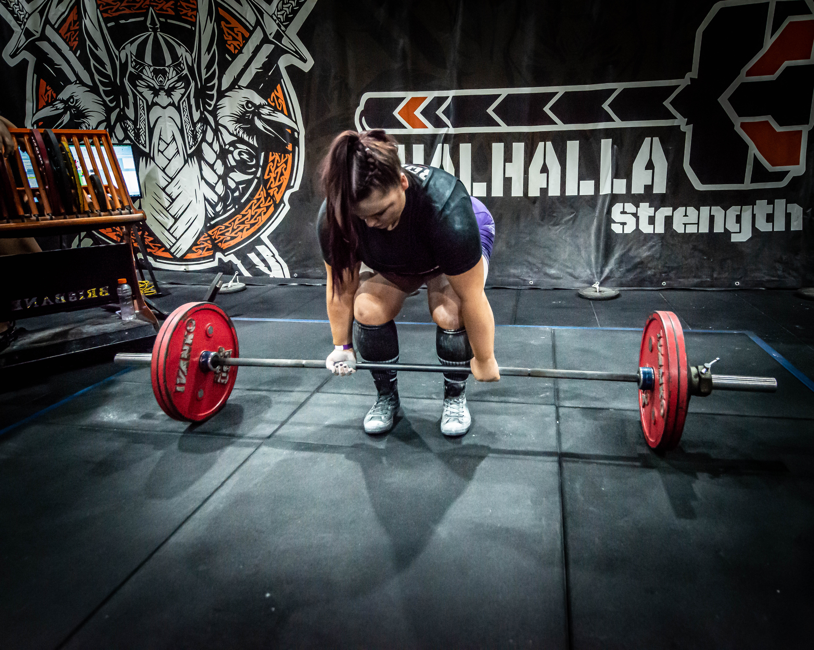

<!--
**thestrongcoder/thestrongcoder** is a ✨ _special_ ✨ repository because its `README.md` (this file) appears on your GitHub profile.

Here are some ideas to get you started:

- 🔭 I’m currently working on ...
- 🌱 I’m currently learning ...
- 👯 I’m looking to collaborate on ...
- 🤔 I’m looking for help with ...
- 💬 Ask me about ...
- 📫 How to reach me: ...
- 😄 Pronouns: ...
- ⚡ Fun fact: ...
-->

# THE STRONG CODER - STEPHANIE HALES

Software Developer  |  UI/UX Designer  |  Creator | Powerlifter 

#### Current Project
I'm currently working on an e-commerce portal for an Automotive and Manufacturing company, I'm the lead designer, and project manager, working with a team of developers. 

#### Learning
Coder Academy Graduate, August 2020

#### About
I'm a GPC Powerlifter, and have a passion for sports and human performance. I would like to see this passion translate to projects within SportsTech. 
